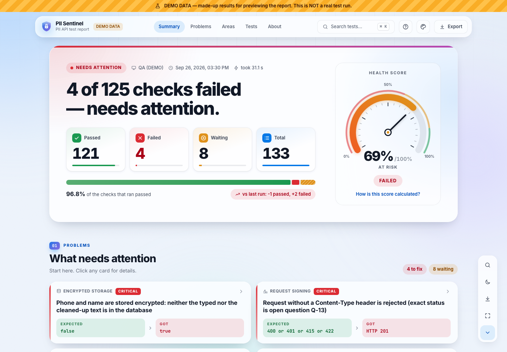

# PII Service — API Test Automation

## The idea

Aisle has a **PII service**: a backend that stores people's personal data (email, phone, name) **encrypted**,
and hands it back only to apps that are allowed to see it.

This project is an **automated test suite** for that service. With one command it checks that the service:

| Checks that it…              | Example                                                                 |
| ---------------------------- | ----------------------------------------------------------------------- |
| **works**                    | save an email, read it back, search by phone, read many users at once   |
| **only trusts signed calls** | a request with a missing, wrong or tampered signature is rejected (401) |
| **respects permissions**     | an app allowed to _search_ emails cannot _read_ phones (403)            |
| **keeps customers apart**    | tenant A can never see tenant B's data                                  |
| **stores data encrypted**    | the database holds ciphertext, not the plain email                      |
| **never leaks**              | error messages never echo personal data                                 |

Every run ends with a **one-page report** that anyone can read in seconds.



### How one test run flows

```
npm run test:all
   │
   ├─▶ tests/…            a test creates fake, unique data and calls the API
   │     └─▶ src/clients      builds the request and SIGNS its exact bytes (src/auth)
   │           └─▶ PII service   verifies the signature and permissions, then answers
   │     ◀── src/assertions   checks status, response shape and values (never prints PII)
   │     ◀── src/db           optionally confirms in the DB that the value is encrypted
   │
   ├─▶ reporting/collector    saves each result WITHOUT any personal data
   └─▶ reporting/generator    builds the report + PDF  →  reports/qa-report/index.html
```

**Signing, in one sentence:** every request body is hashed (SHA-256) and signed with the calling app's private
key (Ed25519). The service rejects anything that doesn't match. The framework does this automatically, so tests
never touch keys.

---

## Folder structure

```
PII_Automation_Framework/
│
├── tests/                          THE TESTS: one folder per area of the service
│   ├── poc/                          1  end-to-end: save → check database → read back
│   ├── health/                       2  service health endpoint
│   ├── pii/                          52 save · read · search · bulk read · data clean-up
│   ├── transient/                    12 temporary phone numbers (create, resolve, promote, expire)
│   ├── free-text/                    10 encryption keys (create, read, revoke)
│   ├── security/                     44 signing · permissions · tenant isolation · leak protection
│   ├── contract/                     5  responses match the documented format
│   ├── db/                           7  data is encrypted in the database
│   └── unit/                         82 self-tests of the framework itself (no service needed)
│
├── src/                            THE FRAMEWORK: reusable code the tests are built on
│   ├── clients/                      talks to the service
│   │   ├── pii-client.ts               one method per endpoint: readPii(), writePii(), searchPii() …
│   │   ├── base-api-client.ts          serialise body once → sign → send the same bytes → log (redacted)
│   │   └── endpoints.ts                the list of all 11 endpoints
│   ├── auth/
│   │   └── ed25519-signer.ts           the request signature (matches the guide byte-for-byte)
│   ├── fixtures/
│   │   ├── test-fixtures.ts            what every test receives: pii, piiAs(), data, tenant, db, log…
│   │   └── steps.ts                    common setup steps: seedUser(), createTransient() …
│   ├── assertions/                   reusable checks: expectSuccess(), expectError(), expectSecretEquals()
│   ├── models/                       the expected shape of every request and response (Zod schemas)
│   ├── data/                         generates fake, unique test data (user IDs, emails, names)
│   ├── db/                           read-only database access (Postgres or MySQL) + query catalog
│   ├── config/                       reads and validates .env; clear messages when something is missing
│   └── utils/                        logger that hides secrets, retry, request IDs, cleanup list
│
├── reporting/                      THE REPORT
│   ├── collector/                    plugs into Playwright; records results with no personal data
│   ├── generator/                    turns results into the report page, history and PDF
│   ├── dashboard/src/                the report page itself (Preact + CSS)
│   │   ├── sections/                   Summary · What needs attention · Endpoints · All tests · About
│   │   ├── components/                 speedometer, rings, top bar, test details panel, dialogs
│   │   └── styles/                     colours, light/dark themes, print/PDF layout
│   ├── core/                         shared logic: health score, statuses, data scrubbing, exports
│   ├── config/report-config.json     health-score weights and quality gates (editable)
│   ├── fixtures/                     made-up DEMO data for previewing the report
│   └── tests/                        45 tests for the report (layout, privacy, accessibility, keys)
│
├── scripts/                        HELPERS (run via npm)
│   ├── test-all.ts                   tests → report → PDF, in one command
│   ├── check-env.ts                  checks your .env and connection; never prints secrets
│   └── generate-caller-keypair.ts    creates a key pair for a calling app
│
├── docs/                           DETAILED GUIDES (setup, scenarios, open questions…)
│   └── test-cases.xlsx               ALL TEST CASES in Excel, grouped by endpoint (npm run docs:testcases)
├── config/db-queries.example.json  template for database queries (copy to db-queries.json)
├── test-data/                      intentionally empty: all data is generated at runtime
├── .github/workflows/              CI: checks every pull request; service tests on demand
│
├── .env.example                    settings template: PENDING_… dummies for everything still owed by Dev
├── PENDING-PLACEHOLDERS.md         EVERY PENDING PLACEHOLDER, where it is, who provides it (npm run docs:pending)
├── playwright.config.ts            test runner: projects (unit / api), timeouts, reporters
└── package.json                    libraries and every npm command
```

**Created locally, never committed:** `.env` (your settings) · `secrets/` (private keys) · `reports/` (reports,
PDFs, history) · `test-results/` (per-test logs) · `node_modules/`.

### Where to go when you want to…

| …                            | go to                                                    |
| ---------------------------- | -------------------------------------------------------- |
| add or change a test         | `tests/<area>/…spec.ts`                                  |
| see every test case in Excel | `docs/test-cases.xlsx` (refreshed by `npm run test:all`) |
| call an endpoint differently | `src/clients/pii-client.ts`                              |
| change an expected response  | `src/models/`                                            |
| add a setting                | `src/config/env-schema.ts` + `.env.example`              |
| change the report's look     | `reporting/dashboard/src/` (`npm run report:dev`)        |
| change health-score weights  | `reporting/config/report-config.json`                    |

---

## Anatomy of a test

```ts
test(
  'PII-RD-001 Reading one field of a user returns its value',
  { tag: '@smoke' },
  async ({ pii, data, tenant, cleanup }) => {
    const userId = data.userId('rd1'); // 1. fake, unique data
    const email = data.email();
    await seedUser(pii, cleanup, tenant, userId, { EMAIL: email }); // 2. setup: save it

    const read = expectSuccess(
      await pii.readPii({ tenant_id: tenant, user_id: userId, field_names: ['EMAIL'] }), // 3. signed call
      200,
      readPiiDataSchema, // 4. expected status + shape
    );
    expectSecretEquals(read.items[0]?.value, email, 'EMAIL'); // 5. compare without printing the value
  },
);
```

- **Title = ID + what happens + expected result**, e.g. _"PII-AUTH-002 Request with no signature is rejected (401)
  and nothing is saved"_. Anyone should understand a test from its title alone.
- **IDs** never change: `WR` write · `RD` read · `SR` search · `BR` bulk read · `AUTH` signing · `AZ` permissions ·
  `TI` tenant isolation · `DB` database · `UT` self-test.
- **Tags** pick subsets: `@smoke` (15) · `@security` (45) · `@db` (8) · `@poc` (1) · `@regression` (132).
- **Waiting on the backend team?** Call `blockedBy('Q-14', 'reason')` in the test. It shows as **Waiting**, never
  as passed. Open questions: [docs/known-gaps-and-questions.md](docs/known-gaps-and-questions.md).

---

## Running it

**Without the service** (checks your setup, about 5 minutes; needs Node.js 20.19+):

```bash
npm ci && npx playwright install chromium
npm run verify                     # 82 self-tests → "82 passed"
npm run report:demo && npm run report:open -- --demo    # sample report (made-up data)
```

**Against the service:**

```bash
cp .env.example .env               # fill it in: every line is explained
npm run keys:generate -- secrets/primary-caller          # send the .pub.pem to the backend team
npm run check-env                  # confirms settings + connection
npm run test:all                   # all 133 tests → report → PDF
npm run report:open
```

Subsets: `npm run test:all -- --grep @smoke` · one test: `npx playwright test --grep PII-RD-001` · one folder:
`npx playwright test tests/security`. All commands: [docs/execution-guide.md](docs/execution-guide.md).

---

## The report

`reports/qa-report/index.html` (plus `report.pdf`, `results.csv`, `summary.txt`):

- **Banner**: the answer in one sentence, four numbers, and a **health score** speedometer (0–100%)
- **01 What needs attention**: each failure as **Expected → Got**, plus checks waiting on the backend
- **02 How each endpoint did**: one tile per endpoint (method + path); click one to see its test cases
- **03 All tests**: every test case under a heading per endpoint, with search; click a row for details
- **04 About this run**: environment, time, duration

**Keyboard shortcuts** (press `?` in the report):

| Key          | Action                | Key         | Action                         |
| ------------ | --------------------- | ----------- | ------------------------------ |
| `⌘/Ctrl K`   | search everything     | `F` `W` `A` | show Failed / Waiting / All    |
| `/`          | search the test list  | `← →`       | previous / next page           |
| `1`–`4`      | jump to section 01–04 | `J` `K`     | next / previous test (details) |
| `0` / `Home` | back to top           | `E`         | export menu                    |
| `D`          | dark / light mode     | `Q`         | fold the quick-action bar      |
| `Esc`        | close                 | `?`         | show all shortcuts             |

More: [docs/reporting.md](docs/reporting.md).

---

## Rules (enforced in code)

- Never print or log personal data, keys, signatures or passwords. The logger and assertions hide them.
- Never commit `.env`, `secrets/`, `*.pem` or `config/db-queries.json` (they are git-ignored).
- Fake data only: non-production tenants and team-approved phone numbers.
- The database is read-only. Never change shared data without approval.
- Never fake results: a test that can't run shows as Waiting or Skipped, with the reason.

---

## Status and docs

| Part                 | Tests | Status                                                                                                                      |
| -------------------- | :---: | --------------------------------------------------------------------------------------------------------------------------- |
| Framework self-tests |  82   | all passing                                                                                                                 |
| Report tests         |  47   | all passing                                                                                                                 |
| PII service tests    |  133  | written; **not yet run against a real service**: waiting on the items in [PENDING-PLACEHOLDERS.md](PENDING-PLACEHOLDERS.md) |

[Pending placeholders](PENDING-PLACEHOLDERS.md) · [Test cases (Excel)](docs/test-cases.xlsx) · [Setup](docs/setup-guide.md) · [Commands](docs/execution-guide.md) · [Test scenarios](docs/test-scenarios.md) ·
[Open questions](docs/known-gaps-and-questions.md) · [Tech doc v3 analysis](docs/tech-doc-v3-analysis.md) · [Architecture](docs/framework-architecture.md) ·
[Database](docs/database-setup.md) · [Troubleshooting](docs/troubleshooting.md)
