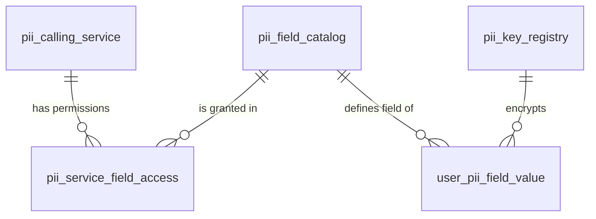

# Where PII is stored: a guide to the PII service database

This guide explains where the PII service stores the data that reaches it through the Aisle PII facade, and in which
table each endpoint's data ends up. It also shows what QA has confirmed so far by connecting to the database.

**Sources:** every item on ClickUp task [PII service for DPDP](https://app.clickup.com/t/86d3yjxhh), read on 2026-10-01:

| Item                                                                  | What it is                                                                      | Used here for                                                               |
| --------------------------------------------------------------------- | ------------------------------------------------------------------------------- | --------------------------------------------------------------------------- |
| `tech_doc_v3_detailed.md`                                             | **Latest full design** (11k lines, chapters 00–21)                              | Main source: exact DDL, roles, API, errors, audit                           |
| `tech_doc_v3_knowledge_base.md`                                       | Short summary of v3                                                             | Overview                                                                    |
| `arch_v3.png`                                                         | Latest architecture diagram                                                     | Overview                                                                    |
| `tech_doc_v2.md`, `tech_doc_v1.md`, `arch_v1/v2.png`                  | Older designs, superseded                                                       | [§9 How the design changed](#9-how-the-design-changed-v1--v3)               |
| `pii-data-flow-design.md`                                             | First proposal; describes where Aisle stores PII **today**                      | [§8 Where PII lives today](#8-where-pii-lives-today-before-the-pii-service) |
| `Aisle PII Inventory.xlsx`                                            | DPDP data inventory (≈100 data points; where stored, who can access, retention) | §8                                                                          |
| `Jeevansathi - PII Protection … Framework.pdf`                        | The JS team's framework, shared as a reference                                  | Background only                                                             |
| `Screenshot 2026-08-05…png`                                           | First sketch: services → central PII service → PII store, KMS owns the KEK      | Background only                                                             |
| `test-cases.xlsx`                                                     | An earlier export of this framework's test-case sheet                           | —                                                                           |
| Comments, linked bug [86d4cx21h](https://app.clickup.com/t/86d4cx21h) | Access requests, 401 blip; 422 echoed PII + `tenant_id` (closed as done)        | Context                                                                     |

> **Status (2026-10-01):** the table design below comes from the **design documents**. It has **not been checked against
> a real PII database yet**. The database QA can access (`aisleweb`) is Aisle's main app database and contains
> **none** of the PII-service tables (see [§7](#7-what-qa-checked-in-the-database)). This is tracked as **BQ-04** in
> [backend-open-questions.md](backend-open-questions.md).

---

## 1. The big picture

```
QA automation ──Bearer token──► Aisle PII facade ──Ed25519-signed request──► PII service ──► PII PostgreSQL (pii_db)
                                (sets tenant_id,                             (encrypts /       5 tables + optional idempotency_key
                                 signs the call)                              decrypts)    └─► MongoDB audit_trails (7-day TTL)
                                                                                           └─► KMS/HSM (master keys)
```

The main ideas:

1. **Target state: only the PII service sees readable PII.** Business databases (such as `aisleweb`) keep only the `user_id`. **Today** they still hold the
   plain values (see [§8](#8-where-pii-lives-today-before-the-pii-service)). The PII service is what will replace that.
2. **The PII service has its own PostgreSQL database, `pii_db`.** It is separate from the business database. The spec says: _"The PII Service has no
   business-database connection string. The business database has no PII-database connection string."_
3. **All PII values go into one table, `user_pii_field_value`**, with **one row per user per field**. A user with name, email and phone has 3 rows.
4. **Values are stored encrypted** with AES-256-GCM. A DB reader sees random-looking bytes, never `person@example.com`.
5. **Every read, write and search is logged** in **MongoDB** `audit_trails`, without the values. Entries are kept for 7 days.

---

## 2. The PII tables



| Group                               | Table                      | In one sentence                                                    | Changes when QA calls the API? |
| ----------------------------------- | -------------------------- | ------------------------------------------------------------------ | ------------------------------ |
| **Rule tables** (set up by Dev/Ops) | `pii_calling_service`      | Which services may call the PII service, and each one's public key | No                             |
|                                     | `pii_field_catalog`        | The list of valid PII fields                                       | No                             |
|                                     | `pii_service_field_access` | Which service may read, write or bulk-read which field             | No                             |
|                                     | `pii_key_registry`         | The encryption keys, stored wrapped (encrypted)                    | No (only during key rotation)  |
| **Data table**                      | `user_pii_field_value`     | **The actual encrypted PII values**                                | **Yes**: every write/promote   |
| Optional                            | `idempotency_key`          | Remembers write retries for 24 h ("if adopted")                    | Only if writes send a key      |

### 2.1 `user_pii_field_value`: where the PII is stored

| Column                      | Type                              | Meaning in plain words                                                                                                                     |
| --------------------------- | --------------------------------- | ------------------------------------------------------------------------------------------------------------------------------------------ |
| `user_id`                   | VARCHAR(128), no `\|`             | Whose data it is. Free text, matching staging, where `qa-auto-…` IDs are accepted. The short doc says UUID; the detailed DDL says VARCHAR. |
| `field_name`                | VARCHAR(64) → `pii_field_catalog` | Which field, e.g. `EMAIL`. Must match `^[A-Z][A-Z0-9_]{1,63}$`.                                                                            |
| `ciphertext`                | BYTEA                             | The encrypted value                                                                                                                        |
| `nonce`                     | BYTEA, **exactly 12 bytes**       | A random number used once per encryption. Saving the same value twice gives different ciphertext.                                          |
| `auth_tag`                  | BYTEA, **exactly 16 bytes**       | A tamper seal. If the ciphertext is changed, decryption fails.                                                                             |
| `key_version`               | INTEGER ≥ 1 → `pii_key_registry`  | Which key encrypted this row (needed to decrypt it later)                                                                                  |
| `lookup_token`              | BYTEA (32), nullable              | A fingerprint of the normalized value, used by **search**. Only set for searchable fields (EMAIL, PHONE).                                  |
| `created_at` / `updated_at` | TIMESTAMPTZ                       | When the row was created / last replaced                                                                                                   |

- **Primary key `(user_id, field_name)`.** A write is `INSERT … ON CONFLICT (user_id, field_name) DO UPDATE`. That is why saving EMAIL twice
  **replaces** the value (staging: 201 the first time, 200 after that) and never creates a second row.
- **Indexes:** `(field_name, lookup_token) WHERE lookup_token IS NOT NULL` (search), `(field_name, key_version)` and `(created_at)`.
- **There is no `tenant_id` column in any version of the design.** Staging responses still return `"tenant_id": "aisle"`, so the facade
  or the real table adds it. This is unconfirmed (BQ-04, BQ-29).

### 2.2 `pii_field_catalog`: valid fields

`field_name` (PK), `field_type`, `is_searchable` (default false), `is_active` (default true), timestamps.

- Fields in the design: `FIRST_NAME`, `LAST_NAME`, `EMAIL`, `PHONE`. Staging uses `NAME`.
- **Searchable: EMAIL and PHONE. Names are not searchable.**
- When a field is unknown or inactive, the request is refused (`UNKNOWN_FIELD`).

### 2.3 `pii_calling_service`: who may call

`service_id` (PK, `^[a-z0-9][a-z0-9-]{1,62}$`), `service_name`, `public_key` (Ed25519 SPKI PEM), `active`, timestamps.

- The Aisle facade is one of these callers.
- Setting `active = false` blocks that caller.

### 2.4 `pii_service_field_access`: permissions

`(service_id, field_name)` PK, with three switches that all default to false: `can_read`, `can_write`, `can_bulk_read`.

- The permission check happens **before** any row is fetched or decrypted.
- Read permission does **not** include bulk-read permission.
- There is **no `can_search`** column. The design is unclear on which permission search needs.
- This table is where the `403` replies on staging come from (e.g. temporary phones, BQ-02).

### 2.5 `pii_key_registry`: encryption keys

`key_version` (PK), `kek_version`, `key_provider`, `primary_provider_wrapped_dek`, `backup_provider_wrapped_dek`,
`status` (`READY` / `ACTIVE` / `READ_ONLY`), `created_at`, `activated_at`.

- A unique index allows **only one `ACTIVE` key**.
- Only **wrapped** (encrypted) data keys are stored here. The master key never leaves KMS/HSM.

### 2.6 `idempotency_key` (optional, "if write idempotency is adopted")

`(caller_id, idempotency_key)` PK, `field_name`, `user_id`, `request_hash`, `created_at`. Rows are purged after 24 h.

- Same key and same body: 200 with the original result.
- Same key and a different body: 409 `IDEMPOTENCY_KEY_REUSED`.

### 2.7 Database roles in the design

| Role               | Can do                                                                                     |
| ------------------ | ------------------------------------------------------------------------------------------ |
| `pii_app`          | Run the service: SELECT/INSERT/UPDATE on `user_pii_field_value`, SELECT on the rule tables |
| `pii_migrator`     | Schema changes                                                                             |
| `pii_keyadmin`     | Insert/update `pii_key_registry`                                                           |
| `pii_readonly_ops` | Metadata only, **with no access to the ciphertext columns** of `user_pii_field_value`      |

> For QA: a user like `pii_readonly_ops` **cannot** run the "stored value is encrypted" checks. When Dev creates QA's read-only user, it needs
> SELECT on `user_pii_field_value` including `ciphertext`, `nonce` and `auth_tag`.

---

## 3. Which endpoint uses which table

| Facade endpoint                         | What happens in the DB                                                                                                                | Tables                                                                                  |
| --------------------------------------- | ------------------------------------------------------------------------------------------------------------------------------------- | --------------------------------------------------------------------------------------- |
| `GET /health/ready`                     | Readiness: configuration, containers, Postgres, keys, canary, replay store, audit. KMS and Mongo do not block readiness.              | (connectivity only)                                                                     |
| `POST /pii-test` (write)                | **Upsert one row** for `(user_id, field)`                                                                                             | **writes** `user_pii_field_value` · reads the 4 rule tables · `idempotency_key` if used |
| `POST /pii-test/read`                   | Selects the user's rows, then decrypts each one with its own `key_version`                                                            | reads `user_pii_field_value`                                                            |
| `POST /pii-test/batch/read`             | **One** query: `WHERE user_id IN (…) AND field_name IN (…)`. Missing fields are left out.                                             | reads `user_pii_field_value` (needs `can_bulk_read` for every field)                    |
| `POST /pii-test/{field}/search`         | Computes the lookup token and finds matching `user_id`s, `ORDER BY created_at LIMIT n`. Decrypts only if `include_values`.            | reads `user_pii_field_value.lookup_token`                                               |
| `POST /transient/phones` (+ resolve)    | Temporary phone mapping with a TTL                                                                                                    | **In no version of the design**: storage unknown (BQ-02, BQ-04)                         |
| `POST /transient/phones/promote`        | Stores the phone permanently as `PHONE` PII                                                                                           | `user_pii_field_value` (field `PHONE`) per the API doc. The temporary store is unknown. |
| `POST /free-text/keys` (+ read, revoke) | Creates / returns / revokes an encryption **key**. **No text is ever sent** (see [§3.1](#31-free-text-the-pii-db-holds-only-the-key)) | Key in the PII DB, table unknown (BQ-45). The text itself is in aisleweb (BQ-46).       |
| _every call above_                      | One audit document (see §6)                                                                                                           | **MongoDB** `audit_trails` (not Postgres)                                               |

There are **no update or delete endpoints** in the design, so a value can be replaced but never removed (BQ-10).

### 3.1 Free text: the PII DB holds only the key

You cannot save free text (a bio, a chat message) through the PII service: there is no endpoint for it. The free-text
endpoints manage **keys**:

| Endpoint                      | You send | You get back                                                                         |
| ----------------------------- | -------- | ------------------------------------------------------------------------------------ |
| `POST /free-text/keys`        | `{}`     | `key_id` (UUID), **`key`** (raw 256-bit AES key), `algorithm: AES-256-GCM`, `ACTIVE` |
| `POST /free-text/keys/read`   | `key_id` | The same key again (only while it is `ACTIVE`)                                       |
| `POST /free-text/keys/revoke` | `key_id` | `status: REVOKED`, `revoked_at`                                                      |

The most likely flow, using a bio as the example. **Steps 2, 3, 5 and 6 are QA's reading and are not yet confirmed (BQ-46, BQ-47):**

```
          PII service (PII DB)                          Aisle (aisleweb)
1. Aisle: "give me a key"  ──►  creates key K1
                           ◄──  key_id=K1 + key
2.                                                      Aisle encrypts the bio with that key
3.                                                      Aisle saves bio_ciphertext + bio_key_id = K1   ◄── the link
── later, to show the bio ──
4. Aisle: "give me key K1" ──►  checks K1 is ACTIVE, returns it
5.                                                      Aisle decrypts the bio
── account deleted (DPDP erasure) ──
6. Aisle: "revoke K1"      ──►  K1 → REVOKED          ciphertext stays, but can never be decrypted again
```

Step 6 is called **crypto-shredding**. Long texts stay in Aisle's own database, and the PII service controls whether they can ever be read.

| Data type            | Who encrypts                                | Where the encrypted value lives    | What links the two DBs | What the PII DB holds |
| -------------------- | ------------------------------------------- | ---------------------------------- | ---------------------- | --------------------- |
| Name / email / phone | PII service                                 | **PII DB**, `user_pii_field_value` | `user_id`              | The encrypted value   |
| Free text            | **Aisle** (with a key from the PII service) | **aisleweb**                       | **`key_id`**           | Only the key          |

None of the design docs (v1–v3) mentions free-text keys. The Jeevansathi reference keeps free text unencrypted, so
Aisle has chosen a stronger model here. Open questions: **BQ-45** (key table), **BQ-46** (text storage and key
granularity), **BQ-47** (revoke = erasure).

---

## 4. Worked example: one EMAIL write, step by step

```json
POST /api/v1/pii-test   { "user_id": "qa-auto-…-a", "field": "EMAIL", "value": "Person@Example.com" }
```

1. **Facade**: checks the Bearer token, adds `tenant_id = "aisle"`, signs the body with its Ed25519 private key and forwards it to `POST /api/v1/pii/EMAIL`.
2. **Authentication**: the PII service looks up the facade's `public_key` in `pii_calling_service` and verifies the signature.
3. **Authorization**: the service checks `pii_service_field_access` for `can_write` on `EMAIL`. If it is missing, the service returns 403 and stops.
4. **Field check**: is `EMAIL` in `pii_field_catalog` and active?
5. **Normalize** (see §5): `Person@Example.com` becomes `person@example.com`. **The normalized value is what gets encrypted**, so a read returns it.
6. **Encrypt**: the service takes the `ACTIVE` key from `pii_key_registry` (say `key_version = 1`), creates a fresh 12-byte nonce and encrypts with
   AES-256-GCM. The **AAD** `PII-AAD-V1|env|user_pii_field_value|user_id|field_name|key_version` is mixed in. This ties the ciphertext to this exact row:
   if someone copies it to another user's row, it will not decrypt.
7. **Lookup token**: EMAIL is searchable, so `HMAC-SHA-256(search_key, "PII-LOOKUP-V1"␟EMAIL␟person@example.com)` is stored.
8. **Save** (upsert):

   | user_id     | field_name | ciphertext | nonce (12 B) | auth_tag (16 B) | key_version | lookup_token |
   | ----------- | ---------- | ---------- | ------------ | --------------- | ----------- | ------------ |
   | qa-auto-…-a | EMAIL      | `\x8f3a…`  | `\x1c9e…`    | `\x77b2…`       | 1           | `\x4d01…`    |

9. **Audit**: `{action: PII_WRITE, status: SUCCESS, key_version, …}` goes to MongoDB, asynchronously, after the commit.

A **read** runs the same steps in reverse. It checks `can_read`, fetches the row, and picks the key using **the row's own `key_version`** (not the
current active key). It then decrypts with the same AAD and returns the value.

---

## 5. Normalization and limits (from the design)

| Field             | Normalization                                                                 | Max length |
| ----------------- | ----------------------------------------------------------------------------- | ---------- |
| EMAIL             | Unicode NFKC, trim, exactly one `@`, **whole address lowercased**             | 320        |
| PHONE             | Parsed with default region **India**, must be valid, stored as E.164 (`+91…`) | 20         |
| NAME / FIRST_NAME | NFKC, trim, internal spaces collapsed, **case kept**                          | 128        |
| any `value`       | —                                                                             | 1–1,024    |
| `user_id`         | —                                                                             | 1–128      |

**Other limits in the design:**

- Batch: up to 1,000 `user_ids` and 50 `fields` per request, with a per-caller cap (default 50, max 500) that returns 400 `BATCH_TOO_LARGE`. Staging behaves differently (BQ-18).
- Search: returns at most 20 results by default (max 100). A larger `limit` is silently clamped and `truncated` is set.
- Rate limits: 10 searches/s and 500 requests/s per caller (429).

---

## 6. Audit trail (MongoDB `audit_trails`)

- **Fields:** `request_id`, `correlation_id`, `caller_service`, `action`, `field_name`, `user_ids[]`, `fields_requested[]`, `fields_released[]`, `status`,
  `reason_code`, `key_versions_used[]`, `result_count`, `source_ip`, `duration_ms`, `environment`, `created_at`, `expires_at` (= created + 7 days, TTL index).
- **Actions:** `PII_WRITE`, `PII_READ`, `PII_SEARCH`, `PII_BATCH_READ`, `AUTH_FAILURE`, `AUTHZ_FAILURE`, plus key and service events.
  There is no `PII_UPDATE` or `PII_DELETE`.
- **Statuses:** `SUCCESS`, `DENIED`, `NOT_FOUND`, `CRYPTO_FAILURE`, `ERROR`.
- **Never stored:** values, search terms, keys, signatures, request bodies.
- **Search:** logs only `result_count`. With `include_values`, each returned value adds a `PII_READ`.
- **Bulk read:** one `PII_BATCH_READ`, plus an `AUTHZ_FAILURE` per denied field.
- **Lookup:** QA could find a run's entries with `db.audit_trails.find({ request_id: "<x-request-id>" })`, once access exists (BQ-30).

---

## 7. What QA checked in the database

On 2026-10-01 QA connected with the read-only credentials in `.env` (PostgreSQL 13.15 through PgBouncer, port 6432, user
`qa_read_only`, session forced read-only).

| Check                                          | Result                                                                                                                                                                                                                                  |
| ---------------------------------------------- | --------------------------------------------------------------------------------------------------------------------------------------------------------------------------------------------------------------------------------------- |
| Database configured in `.env`                  | `aisleweb`, Aisle's **main app database** (~20,000 tables; 481 visible to `qa_read_only`)                                                                                                                                               |
| Any of the PII-service tables?                 | **No.** There is no `user_pii_field_value`, `pii_key_registry`, `pii_calling_service`, `pii_field_catalog`, `pii_service_field_access` or `idempotency_key`, and no table with `pii`, `transient`, `free_text` or `tenant` in its name. |
| Schemas                                        | `public`, `user_procedures` only                                                                                                                                                                                                        |
| Startup option `default_transaction_read_only` | Rejected by PgBouncer, so the read-only mode has to be set after connecting (`SET SESSION CHARACTERISTICS AS TRANSACTION READ ONLY`)                                                                                                    |
| Other databases on the server                  | Not inspected: several have `_production` names. QA must not read those.                                                                                                                                                                |

This matches the design: the PII service has **its own** database (`pii_db`), separate from `aisleweb`. **QA has not been given access to it yet.**

### What to ask Dev (BQ-04)

1. Host, database name and a **read-only** user for the PII service's own PostgreSQL on staging. The user needs SELECT on the ciphertext columns (see §2.7).
2. Confirm the real columns of `user_pii_field_value`: where `tenant_id` lives, and that `user_id` is VARCHAR(128). Confirm the field names (`NAME` vs `FIRST_NAME`/`LAST_NAME`).
3. Which tables hold **transient phones** and **free-text keys**? Neither appears in any version of the design. For
   free text, see BQ-45 to BQ-47.
4. Is `idempotency_key` in use?
5. Read access to MongoDB `audit_trails` (BQ-30).
6. Confirm the DB server behind `aisleweb` is staging (several `_production` database names are on it).

### The queries QA will run once access is granted

These are written against the design schema. Adjust them to the confirmed columns. They go in `config/db-queries.json`, as described in [database-setup.md](database-setup.md).

```sql
-- 1. Row exists and is stored encrypted (there is no readable-value column to select)
SELECT user_id, field_name, ciphertext AS encrypted_value, key_version,
       octet_length(nonce) = 12 AS nonce_ok, octet_length(auth_tag) = 16 AS tag_ok,
       lookup_token IS NOT NULL AS has_token, created_at, updated_at
FROM user_pii_field_value WHERE user_id = $1 AND field_name = $2;

-- 2. A replace keeps exactly one row
SELECT count(*) FROM user_pii_field_value WHERE user_id = $1 AND field_name = $2;

-- 3. Exactly one ACTIVE key; every row points at a known key version
SELECT key_version, status, activated_at FROM pii_key_registry;
SELECT count(*) FROM user_pii_field_value v LEFT JOIN pii_key_registry k USING (key_version) WHERE k.key_version IS NULL;

-- 4. Which fields exist and which are searchable
SELECT field_name, field_type, is_searchable, is_active FROM pii_field_catalog;
```

Expected results (design):

- Query 1 returns one row, with `nonce_ok` and `tag_ok` both true.
- `has_token` is true for EMAIL/PHONE and false for names.
- After a re-save, the `ciphertext` and `nonce` change and `updated_at` moves forward. This happens even when the value is the same.
- The readable value does not appear in the bytes (plain, hex or Base64).
- `key_version` matches the API response.
- Two users with the same normalized email have the same `lookup_token`.

---

## 8. Where PII lives today (before the PII service)

`pii-data-flow-design.md` documents that Aisle's Rails app currently stores the three primary fields **in plain text in `aisleweb`**:

| Field        | Current table.column                    | Linked from             |
| ------------ | --------------------------------------- | ----------------------- |
| First name   | `profiles.first_name`                   | —                       |
| Email        | `account_emails.name`                   | `profiles.email_id`     |
| Phone number | `sms_notification_phone_numbers.number` | `users.phone_number_id` |

The `Aisle PII Inventory.xlsx` agrees: first name, mobile and email are kept in PostgreSQL, **are never deleted**, and are readable by product, tech,
marketing, support, data-science and curation teams.

The DPDP project exists to move these values into the PII service's encrypted table. Once that happens, `aisleweb` keeps only an ID.

> ⚠ These are **real users' personal data**. QA never queries these columns. The test framework only uses synthetic data written through the facade.

---

## 9. How the design changed (v1 → v3)

| Topic          | v1                                                                                                                                            | v2                                                                     | v3 (current)                                                       |
| -------------- | --------------------------------------------------------------------------------------------------------------------------------------------- | ---------------------------------------------------------------------- | ------------------------------------------------------------------ |
| Storage        | One table **per field** (`email_value`, `first_name_value`, `phone_value`). Identical values deduplicated. Callers store an opaque reference. | **One table** `user_pii_field_value`, keyed by `(user_id, field_name)` | Same, with FKs to the field catalog and key registry               |
| Tenant         | `application_id` column, part of the AAD                                                                                                      | `application_id` column, part of the AAD                               | **Removed**: one physical DB per application                       |
| Caller auth    | One shared Ed25519 platform key (in env)                                                                                                      | Same                                                                   | **One key pair per service**, public keys in `pii_calling_service` |
| Authorization  | None: a valid signature allowed everything                                                                                                    | Same                                                                   | **DB permission matrix** `pii_service_field_access`                |
| Field list     | JSON config                                                                                                                                   | JSON config                                                            | **`pii_field_catalog` table**                                      |
| Key registry   | `key_registry` per field and type; statuses PENDING/ACTIVE/RETIRED/DESTROYED                                                                  | `key_registry`, primary + backup wrapped key                           | `pii_key_registry`, READY/ACTIVE/READ_ONLY, forward-only rotation  |
| Replay defence | Phase 2 (Redis nonce, 300 s window)                                                                                                           | Phase 2                                                                | Phase 2, **not in Phase 1**                                        |

Unchanged throughout: AES-256-GCM (12-byte nonce, 16-byte tag), the HMAC lookup token for search, MongoDB audit with a 7-day TTL, KEK in KMS and DEKs only in memory.

**Inconsistencies inside the v3 detailed doc** (worth confirming with Dev before writing tests on them):

- The key registry DDL has one global key lineage, while the code samples assume one per field and type.
- `lookup_token` is described as UNIQUE in one place but has a non-unique index in another. A unique token would stop two users sharing an email.
- Write status: the spec says 200 on update, but the code sample always returns 201. Staging returns 200.
- Bulk read: when one field is denied, one section fails the whole request and another expects a per-field `FORBIDDEN`.
