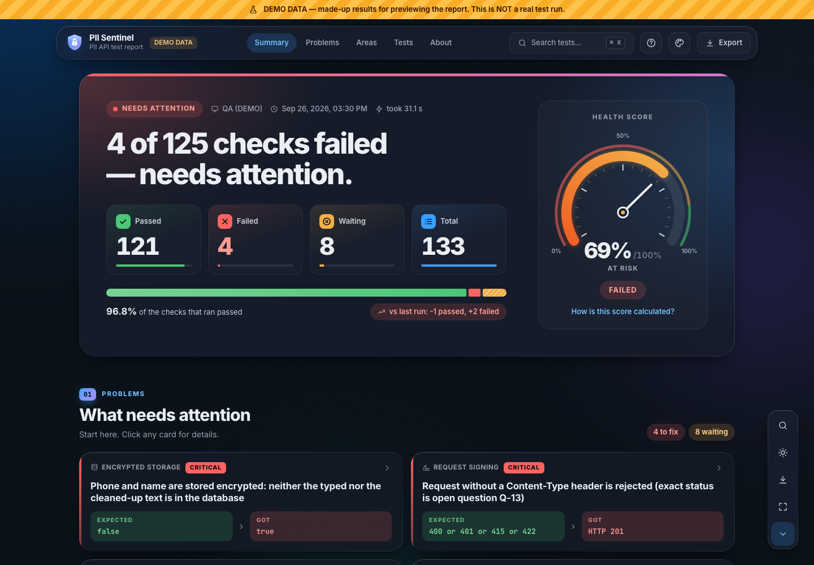
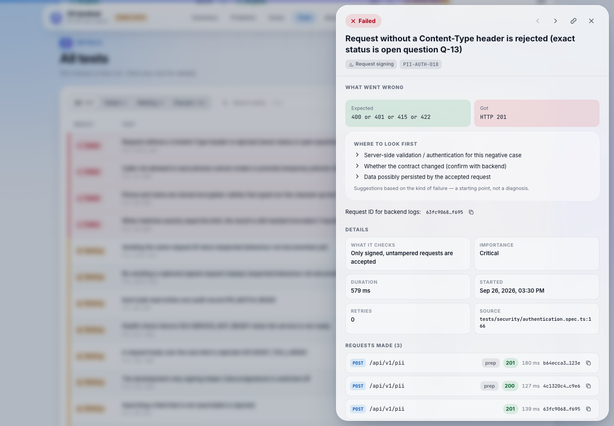
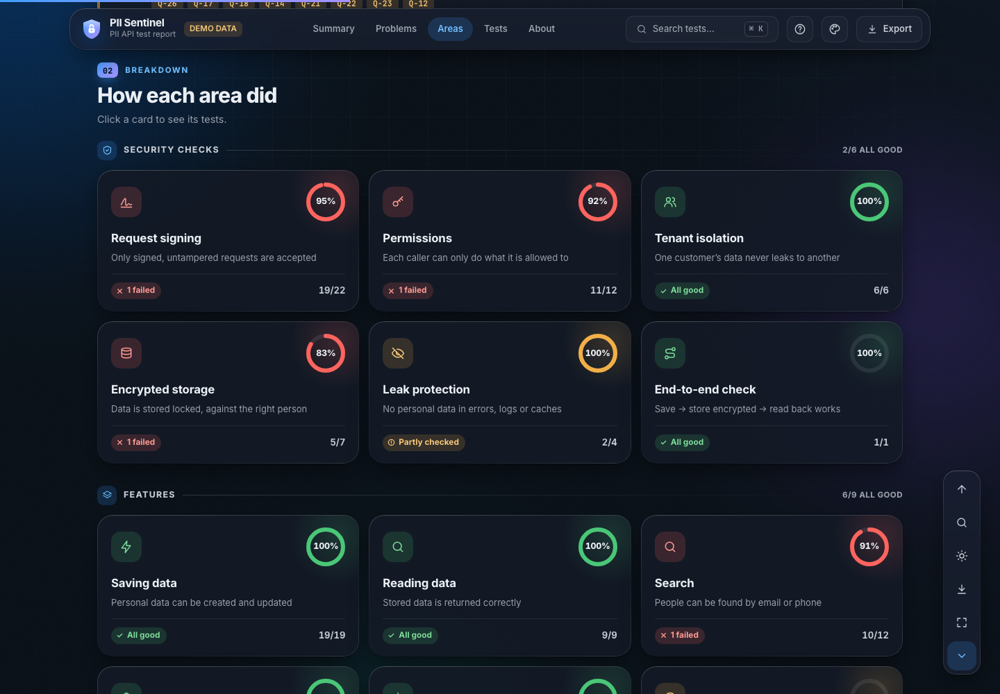
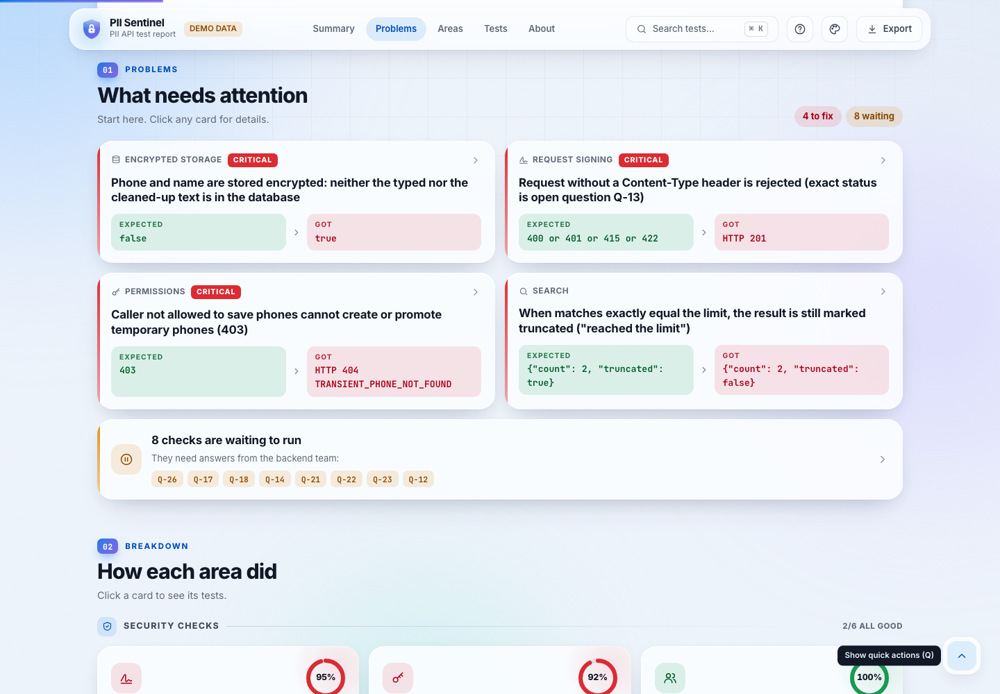
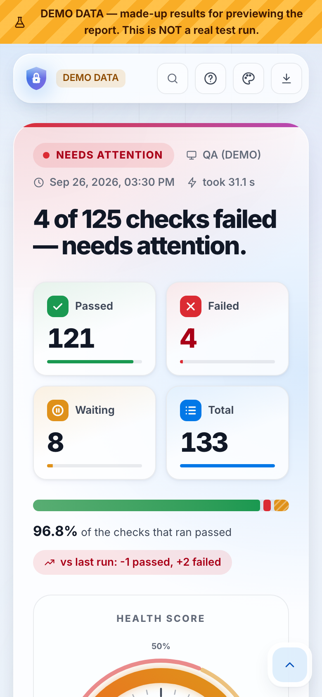
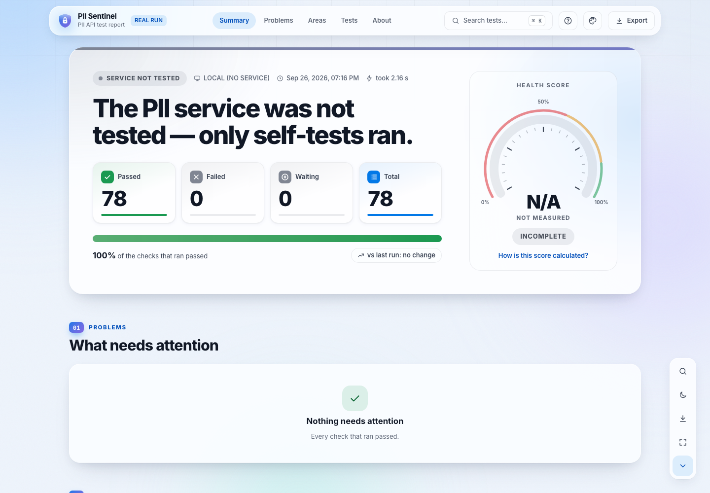

# PII Sentinel — the test report

A small, single-page report anyone can read in seconds. It is generated after every test run, needs no server,
and never contains personal data.


## What’s on the page

The top bar links straight to each part (Summary · Problems · Areas · Tests · About) and highlights where you are.

| Block                         | What it tells you                                                                                                                                                                                                                                                                  |
| ----------------------------- | ---------------------------------------------------------------------------------------------------------------------------------------------------------------------------------------------------------------------------------------------------------------------------------- |
| **Summary**                   | A coloured banner: a status pill (“Needs attention”, “All clear”, “Service unreachable”, “Service not tested”), one plain sentence with the answer, four big numbers (Passed · Failed · Waiting · Total), one bar, “vs last run” and the **health score** speedometer (0–100%).    |
| **01 · What needs attention** | One card per failure showing the area, whether it is critical, and **Expected → Got** side by side. Below that, one card for checks waiting on backend answers, with the question IDs. If the service was unreachable you see **one** clear message instead of dozens of failures. |
| **02 · How each area did**    | A tile per area with a ring and a pass percentage, grouped into **Security checks** and **Features**, arranged so rows are always even. Click a tile to see its tests.                                                                                                             |
| **03 · All tests**            | The full list: tabs (All · Failed · Waiting · Passed), search, a coloured edge on failed and waiting rows, and a small bar showing each test’s duration. Click any row for details.                                                                                                |
| **04 · About this run**       | Environment, time, duration, typical response time, framework self-test result, leftover test data and commit.                                                                                                                                                                     |

Also on the page: light, dark and auto themes; six accent colours; a floating quick-action bar whose last button
folds it away (back-to-top only appears once you scroll); and Export (PDF, CSV, JSON, Slack/ClickUp summary).

**Keyboard:** `⌘/Ctrl K` search · `/` search tests · `1`–`4` sections · `0`/`Home` top · `F` `W` `A` failed / waiting /
all · `←` `→` pages · `J` `K` next / previous test · `E` export · `D` dark mode · `Q` quick-action bar · `Esc` close ·
`?` all shortcuts.

## Commands

```bash
npm run test:all        # run service tests → report → PDF (pass Playwright args after --, e.g. -- --grep @smoke)
npm run report          # build the report from the last run  → reports/qa-report/index.html
npm run report:pdf      # PDF of it                           → reports/qa-report/report.pdf
npm run report:open     # open it
npm run report:demo     # preview with made-up DEMO data      → reports/demo-report/
npm run report:dev      # live-reloading preview while editing the report
npm run report:test     # tests for the report itself
npm run report:clean    # delete generated reports (-- --all also deletes run history)
```

## Rules the report follows

- **Nothing is invented.** Every number comes from recorded results. Missing data shows as “N/A” with a reason.
- **Service tests only.** Framework self-tests are shown as a single line in “About this run” and never inflate
  the service numbers.
- **Health score** (0–100%, shown on a speedometer: red below 60%, amber 60–85%, green from 85%): pass rate 50%, critical-check pass rate 25%, share of checks that ran 15%, and endpoints that
  actually responded 10%. It is capped at 69% if a critical check failed. Checks that never reached the service are
  left out, so an unreachable service shows “not measured”. A run with only framework self-tests also shows N/A. The page explains this via “How is this score calculated?”,
  and the weights live in `reporting/config/report-config.json`.
- **“vs last run”** only compares runs of the same kind (same projects and filters), so smoke runs are not
  compared with full regressions.
- **Self-tests are not a service result.** If only the framework's own tests ran, the page says “The PII service was
  not tested” and shows no health score.
- **Demo data** is always labelled: striped ribbon, “DEMO DATA” tag, PDF header and summary tag. It can never enter real
  run history.

## Privacy

The report stores only test names, results, timings, HTTP status codes and random request IDs. Request and response
bodies, headers, signatures, keys and credentials are never collected. All text is scrubbed three times: when it is
collected, when the report is built, and when the page shows it. The build **refuses to write** a report whose data
looks like an email, private key or signature. A test injects real-looking secrets and checks that none of them reach
the page or any file.

## How it works (for maintainers)

```
Playwright run ─▶ reporting/collector  (allow-listed, sanitized)  ─▶ reports/latest/run-data.json
               ─▶ reporting/generator  (validate · enrich · history · self-check · bundle)
               ─▶ reports/qa-report/  index.html · assets/ · data/ · report.pdf · results.csv · results.json · summary.txt
```

- `reporting/core/` — data model, analytics, sanitizer, exporters (shared by the generator and the page)
- `reporting/dashboard/src/` — the page (Preact, about 100 KB, no chart library; the speedometer and rings are plain SVG)
- `reports/history/` — one small file per real run, which powers “vs last run”. CI keeps it between runs.

## Screenshots

|                                     |                                        |
| ----------------------------------- | -------------------------------------- |
|  |    |
|   |  |
|       |        |

Screenshots 01–06 use demo data. Screenshot 07 is a real local run where only the framework self-tests ran.
